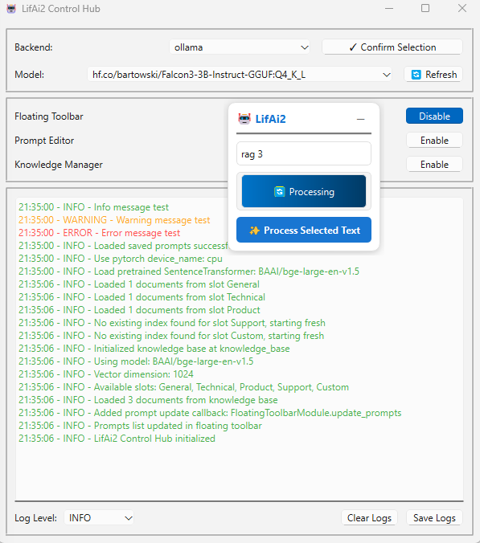

# 🪄 LifAi2: Next-Generation Local LLM Assistant Framework

### A comprehensive, async-powered AI hub with advanced prompt management, custom temperature controls, and seamless integration with Ollama & LM Studio



---

## 🚀 Latest Features & Improvements

- **🌡️ Custom Temperature Controls**: Fine-tune AI creativity per prompt (0.0-2.0) for precision control over response randomness
- **⚡ Advanced AI Client Integration**: Native LM Studio API v0 support with TTL management, enhanced Ollama endpoints, and comprehensive performance monitoring
- **🎯 Robust Prompt Management**: GUI-based editor with JSON storage, automatic backups, emoji labeling, and drag-n-drop reordering
- **🔄 Async-First Architecture**: Complete modernization with Python 3.9+ async/await for superior performance and responsiveness
- **🛠️ Modular Plugin System**: Clean separation between core, modules, and utilities following SOLID principles
- **📊 Performance Analytics**: Real-time metrics for tokens/sec, response times, and model resource usage
- **🎨 Enhanced User Experience**: Interactive prompt flow diagrams, quick review modes, and intuitive floating toolbar
- **🔒 Enterprise-Grade Reliability**: Comprehensive error handling, validation, automated backups, and robust logging

---

## 📦 Core Features

### 🎯 **Advanced Prompt Management**
- **Custom Temperature Controls**: Per-prompt temperature settings (0.0-2.0) for precise creativity control
- **Visual Prompt Editor**: Drag-and-drop reordering, emoji labeling, and intuitive GUI interface
- **Automatic Backups**: 5-generation backup rotation with timestamp preservation
- **JSON-Based Storage**: Transparent, portable prompt data with UUID identification
- **Quick Review Mode**: Instant preview of AI responses without text replacement

### ⚡ **Next-Gen AI Integration**
- **LM Studio Native API**: Optimized `/api/v0/` endpoints with TTL management and performance tracking
- **Enhanced Ollama Support**: Latest `/api/embed` endpoints with batch processing capabilities
- **Dual Backend Support**: Seamless switching between Ollama and LM Studio with unified interface
- **Performance Monitoring**: Real-time tokens/sec, response time, and model resource analytics
- **Structured Outputs**: JSON schema validation and response formatting

### 🛠️ **Professional Architecture**
- **Async-First Design**: Non-blocking operations with Python 3.9+ async/await patterns
- **Modular Plugin System**: Clean separation following SOLID principles for extensibility
- **Comprehensive Error Handling**: Robust logging, validation, and graceful failure recovery
- **Cross-Platform Compatibility**: Windows and macOS support with native OS integration

### 🎨 **Enhanced User Experience**
- **Floating Toolbar**: Always-accessible text processing with customizable prompt selection
- **Interactive Help System**: Dynamic prompt flow diagrams with backend-specific guidance
- **Console-Free Launch**: Clean desktop experience with `run.pyw` double-click execution
- **Responsive UI**: Modern PyQt6 interface with smooth animations and visual feedback

---

## 🚀 Requirements

- **Python**: Version 3.9+ required (leveraging modern async/await features)
- **AI Backend**: Choose one or both:
  - **[Ollama](https://ollama.ai/)**: For open-source model support with latest API features
  - **[LM Studio](https://lmstudio.ai/)**: For advanced model management with native API optimization
- **Operating System**: Windows/macOS with native OS integration
- **Dependencies**: Automatically installed via `requirements.txt` (PyQt6, httpx, aiofiles, etc.)

---

## 📥 Installation

1. Install either [OLLAMA](https://ollama.ai/) or [LM Studio](https://lmstudio.ai/)
2. Clone the repository:
   ```bash
   git clone https://github.com/yourusername/LifAi2.git
   cd LifAi2
   ```
3. Install Python dependencies:
   ```bash
   pip install -r requirements.txt
   ```

---

## 🎮 How to Use

### 🚀 **Getting Started**

1. **Launch the application:**
   - **🎯 Recommended**: Double-click `run.pyw` for console-free launch
   - **🛠️ Debug mode**: Run `python run.py` for console output
   - **🔧 Alternative**: Use `pythonw run.pyw` command

2. **Configure your prompts:**
   - Open the **Prompt Editor** from the app hub
   - Create/edit prompts with custom **temperature settings** (0.0-2.0):
     - `0.0` = Deterministic, consistent responses
     - `0.7` = Balanced creativity (default)
     - `1.5` = High creativity for brainstorming
     - `2.0` = Maximum creativity for artistic tasks
   - Add emoji labels and organize with drag-and-drop

3. **Use the floating toolbar:**
   - Click **"Toggle Toolbar"** in the app hub
   - Select your desired prompt from the dropdown
   - Click **"Process Text"** and select any text
   - AI processes with your custom temperature setting ✨

### 🌡️ **Temperature Guide**
- **Factual Analysis**: Use 0.0-0.3 for consistent, deterministic responses
- **General Enhancement**: Use 0.5-0.8 for balanced improvement
- **Creative Writing**: Use 1.0-1.5 for varied, creative outputs
- **Brainstorming**: Use 1.5-2.0 for maximum creativity and diversity

---

## 🏗️ Architecture

### 🧩 **Modern Modular Design**
- **Core Framework**: Central app hub with async coordination and UI management
- **Plugin Modules**: Extensible features (floating toolbar, prompt editor, knowledge manager)
- **Enhanced Utilities**:
  - **AI Clients**: Async Ollama & LM Studio clients with performance monitoring
  - **Storage Systems**: JSON-based prompt management with automatic backups
  - **UI Components**: PyQt6-based interfaces with modern styling and animations

### 🔄 **Async-First Architecture**
- **Non-blocking Operations**: Python 3.9+ async/await for I/O-bound tasks
- **Performance Patterns**: HTTPx for async networking, aiofiles for file operations
- **Resource Management**: TTL-based model unloading and memory optimization
- **Error Recovery**: Comprehensive exception handling with graceful degradation

### 📁 **Data Management**
- **Prompt Storage**: `lifai/modules/prompt_editor/prompts.json` with UUID-based identification
- **Automatic Backups**: 5-generation rotation with timestamp preservation
- **Configuration**: User-specific settings excluded from git tracking
- **Logging**: Structured logging with module-specific loggers for debugging

---

## 🤝 Contribute

This project represents a comprehensive local AI assistant framework built with modern Python practices. Contributions, feature requests, and ideas are welcome! Feel free to:
- 🐛 Report bugs or suggest improvements
- 💡 Propose new features or modules
- 🔧 Submit pull requests with enhancements
- 📚 Improve documentation

---

## 🌟 Recent Enhancements (2025)

- **🌡️ Custom Temperature Controls**: Per-prompt temperature settings for fine-grained creativity control
- **⚡ LM Studio Native API Integration**: Optimized performance with `/api/v0/` endpoints and TTL management
- **🔄 Enhanced Ollama Support**: Latest API endpoints with batch processing and performance monitoring
- **🎨 Advanced Prompt Editor**: Drag-and-drop interface with automatic backups and emoji labeling
- **🚀 Async Architecture Modernization**: Complete migration to Python 3.9+ async patterns
- **📊 Performance Analytics**: Real-time metrics for tokens/sec and response analysis

---

## 🙏 Acknowledgments

- **🤖 AI Development Partners**: Claude, Cursor, and other AI assistants enabling rapid development
- **🦙 Ollama Team**: For the exceptional local LLM platform and API design
- **🏢 LM Studio**: For the powerful model management and native API capabilities
- **🐍 Python Community**: For async/await, PyQt6, and the incredible ecosystem
- **🌍 Open Source**: For the foundation that makes projects like this possible

---

**LifAi2**: Where local AI meets professional-grade development 🚀✨