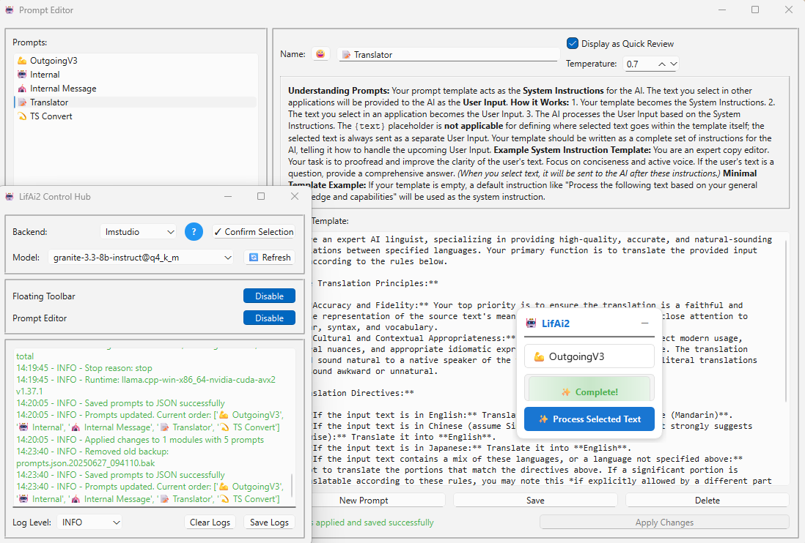

# 🪄 LifAi2: Local LLM-Powered Python App (Ollama & LM Studio)

### A modular AI hub with a floating toolbar for text enhancement, RAG support, and advanced prompt editing



---

## 🚀 Key Improvements in v2

- **Robust Prompt Editor**: New GUI-based prompt editor with JSON storage for easy customization, ordering, and backup of prompts.
- **Performance & Modernization**: Major refactor to leverage asynchronous operations, improving responsiveness and scalability.
- **Plugin-Style Modular Architecture**: Clear separation between core, modules, and utilities for maintainability and extensibility.
- **Enhanced Security & Robustness**: Improved error handling, validation, and backup strategies throughout the codebase.
- **Knowledge Management**: Multi-slot knowledge base with fast vector search (FAISS) and RAG integration.
- **UI/UX Enhancements**: Observer pattern for UI components, improved floating toolbar, and quick review features.
- **Prompt Editing as a First-Class Feature**: Edit, reorder, and manage prompts directly in the app.

---

## 📦 Features

- ✍️ **Text Enhancement**: Improve selected text using custom prompts and local LLMs.
- 🧠 **Retrieval-Augmented Generation (RAG)**: Integrate external knowledge for context-aware completions.
- 🛠️ **Prompt Editor**: Create, edit, and organize prompts with a user-friendly interface and JSON-based storage.
- 🔄 **Async Operations**: Fast, non-blocking interactions with LLM backends (Ollama, LM Studio).
- 🧩 **Modular Design**: Plugin-style modules for easy extension and maintenance.
- 🔒 **Robust Error Handling**: Comprehensive logging, validation, and backup for all critical operations.
- 🖥️ **Cross-Platform**: Works on Windows and MacOS.

---

## 🚀 Requirements

- **Python**: Version 3.10 required
- **OLLAMA** or **LM Studio**: For running local LLMs
- **Operating System**: Windows/MacOS

---

## 📥 Installation

1. Install either [OLLAMA](https://ollama.ai/) or [LM Studio](https://lmstudio.ai/)
2. Clone the repository:
   ```bash
   git clone https://github.com/yourusername/LifAi2.git
   cd LifAi2
   ```
3. Install Python dependencies:
   ```bash
   pip install -r requirements.txt
   ```

---

## 🎮 How to Use

1. Launch the app:
   ```bash
   python run.py
   ```
2. Click the "Toggle Toolbar" button in the app hub
3. Select a prompt from the toolbar's dropdown menu (edit/manage prompts via the Prompt Editor)
4. Click the "Process Text" button
5. Select any text you want to improve
6. Wait for the magic to happen! ✨

---

## 🏗️ Architecture

- **Core**: Central app logic and UI hub.
- **Modules**: Plugin-style features (e.g., floating toolbar, prompt editor, knowledge manager).
- **Utils**: Shared utilities (AI clients, knowledge base, clipboard, logging).
- **Config**: Centralized configuration and prompt management.
- **Prompt Storage**: All prompts are managed in `lifai/modules/prompt_editor/prompts.json` for transparency and backup.

---

## 🤝 Contribute

This is a personal learning journey, but contributions and ideas are welcome! Feel free to open an issue or submit a pull request.

---

## 🙏 Thanks

- **AI Coding Assistants**: Empowering creators like me
- **Claude Dev & Cursor**: For their awesome capabilities
- **OLLAMA**: Running local LLMs
- **LM Studio**: Running local LLMs
- **Open-Source Community**: For all the support

---

Thanks for checking out LifAi2! 🚀✨